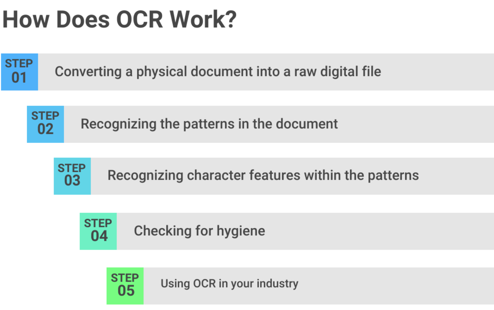

# OCR Text Capture & Translation

An offline desktop app for extracting and translating text from images, built as a computer vision learning project.

**Stack:** OpenCV preprocessing pipeline → EasyOCR (CRAFT + CRNN) → argostranslate



---

## Features

- **OpenCV preprocessing pipeline** — visualize each step in separate tabs
  - Grayscale conversion
  - Non-local means denoising
  - Adaptive binarization
  - Perspective correction (auto document edge detection)
- **EasyOCR inference** — deep learning text detection + recognition, fully offline
- **Detection visualization** — color-coded bounding boxes (green ≥ 90%, yellow ≥ 70%, red < 70%)
- **Real-time parameter tuning** — sliders for all preprocessing + OCR thresholds, with step-impact annotations
- **Offline translation** — recognized text translated to Chinese via argostranslate local models

---

## Pipeline

```
Image
  └─► OpenCV preprocessing
        ① Original
        ② Grayscale       (cvtColor)
        ③ Denoised        (fastNlMeansDenoising)
        ④ Binarized       (adaptiveThreshold)
        ⑤ Perspective     (Canny → findContours → warpPerspective)
              │
              ▼
        EasyOCR inference
          CRAFT detector  → bounding boxes
          CRNN recognizer → text + confidence
              │
              ▼
        NMS (IOU threshold)  →  conf filtering
              │
              ▼
        ⑥ Detections      (cv2.polylines overlay)
              │
              ▼
        langdetect → argostranslate → Chinese translation
```

---

## Tunable Parameters

| Parameter | Affects | Description |
|-----------|---------|-------------|
| Denoise h | ③④⑤ | Denoising strength — higher removes more noise but may blur edges |
| Binarize block | ④ | Adaptive threshold window size — larger handles uneven lighting better |
| Binarize C | ④ | Constant subtracted from mean — higher thins text strokes |
| Canny low | ⑤ | Lower edge detection threshold — lower captures more edges |
| Canny high | ⑤ | Upper edge detection threshold — controls dominant contours |
| conf | ⑥ | Minimum confidence to keep a detection |
| IOU | ⑥ | NMS overlap threshold — lower suppresses more overlapping boxes |

---

## Setup

```bash
# Create a clean environment (Python 3.10 recommended)
conda create -n ocr python=3.10 -y
conda activate ocr

# Install dependencies
pip install -r requirements.txt

# Download offline translation models (one-time, needs internet)
python setup_models.py

# Run
python app.py
```

**Requirements:** `Pillow`, `easyocr`, `langdetect`, `argostranslate`

EasyOCR models (~200 MB) download automatically on first run and are cached in `~/.EasyOCR/`.
argostranslate language packages are downloaded by `setup_models.py` and work offline afterwards.

---

## Supported Languages

OCR: Simplified Chinese + English (EasyOCR `ch_sim` + `en` models)

Translation source languages: English, Japanese, Korean, French, German, Spanish, Italian, Portuguese, Russian, Arabic → Chinese
